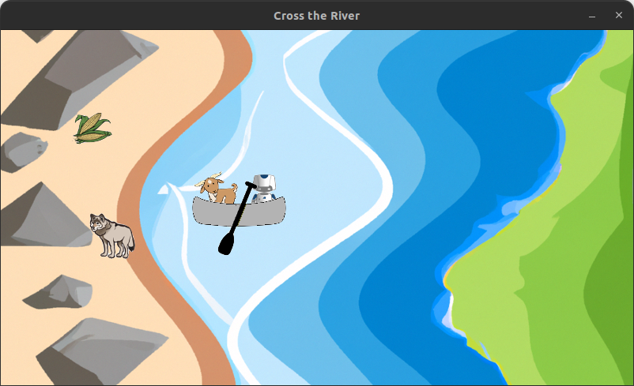
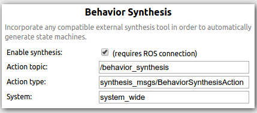
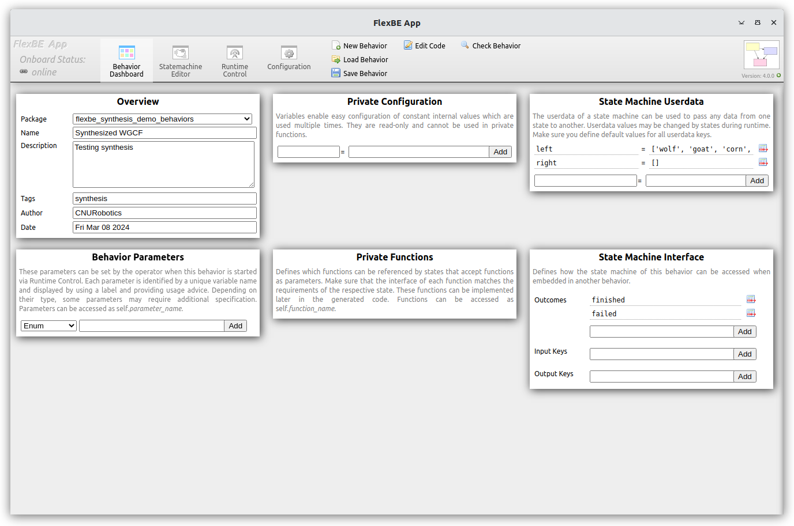
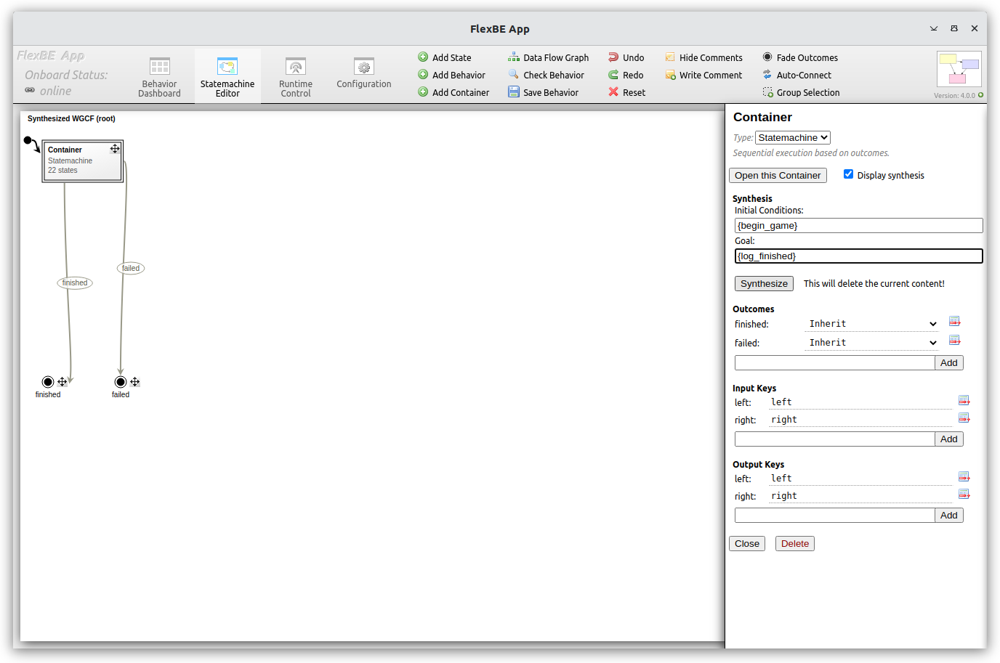
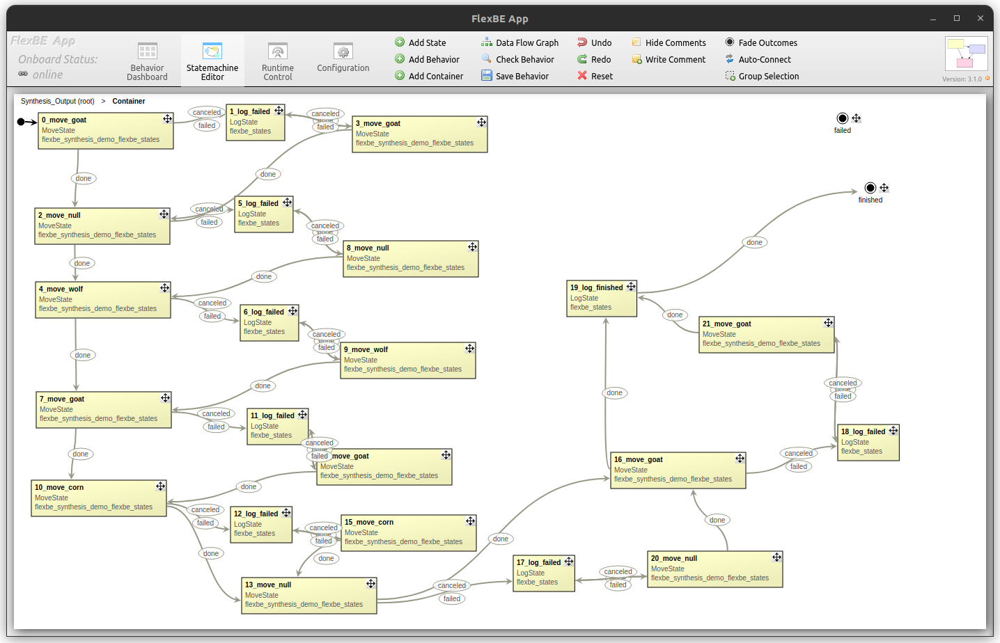
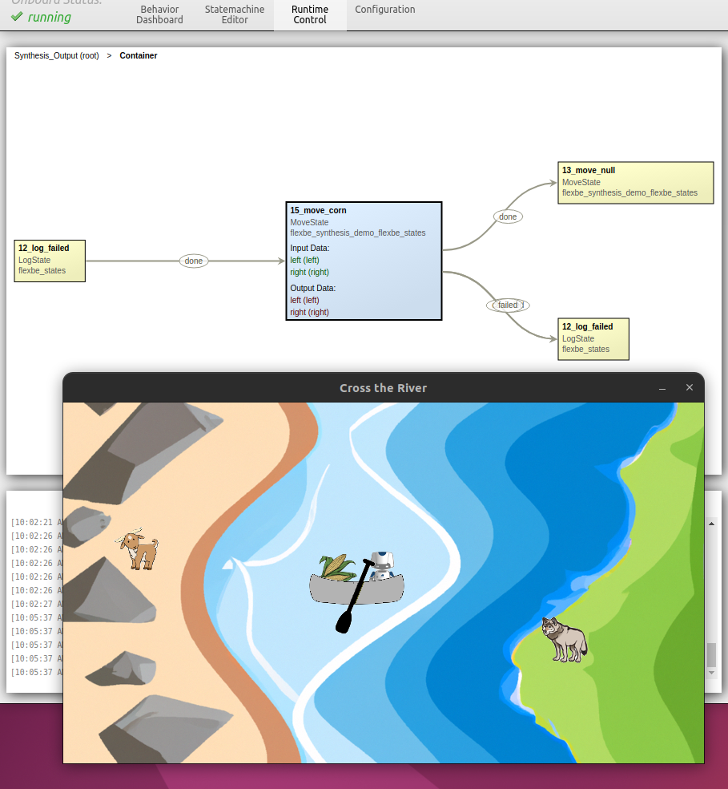

# FlexBE Synthesis Demonstration

This work demonstrates "correct-by-construction" synthesis of executable
robot behaviors using [FlexBE](https://github.com/FlexBE)
given logical specifications written in the GR(1) fragment of Linear Temporal Logic (LTL).

Behavior design is a complex process that requires extensive design, development,
and testing.  Behavioral Synthesis is a powerful process that allows a user to create "correct-by-construction"
behaviors given an initial condition and desired goals.  There is no "free-lunch"
as the specification writing is itself complex; synthesis techniques shift the
burden from designing, implementing, and testing the proper controller,
to defining the correct logical specifications.
The benefit is the logical specifications allow formal verification and model
checking from the outset, and clearly document the system requirements.

This open-source release is part of ongoing work first described in
[Luzier and Conner](https://ieeexplore.ieee.org/search/searchresult.jsp?newsearch=true&queryText=conner%20and%20luzier%20and%20FlexBE).
This repository will document the ongoing development and provide links to the latest tools.

This work builds upon work from [Maniatopoulos et. al](http://dx.doi.org/10.1109/ICRA.2016.7487613)
and [Hayhurst and Conner](http://dx.doi.org/10.1109/SECON.2018.8479047) to provide a
complete and self-contained demonstration of these synthesis techniques.
The synthesis system uses the [`Slugs`](https://github.com/VerifiableRobotics/slugs) GR(1) synthesis tool
described in [Ehlers and Raman](https://www.ruediger-ehlers.de/papers/cav2016.pdf).

## The Demonstration

To provide an accessible introduction to modern synthesis this demonstration
presents the synthesis and execution of a FlexBE-based Hierarchical Finite State Machine
controller that solves a classic logic puzzle.

In our variation, a robotic farmer must cross the river with a wolf, a goat,
and a basket of corn as shown below:



The small boat can only carry one item at a time in addition to the farmer.
If the wolf and goat are left alone while the farmer carries the basket of corn across, the
wolf will eat the goat. If the goat and the corn are left alone,
the goat will eat the corn.  The task at hand is to synthesize a discrete control
strategy that guarantees the safe passage of all items while reacting to intermittent
failures.

This demonstration provides a set of [logical specifications](flexbe_synthesis_demo_behaviors/specs/wgcf.yaml)
that encode the environmental rules using the GR(1) fragment of LTL.


# System Setup

This demonstration uses custom versions of the FlexBE system that have an additional
tagging standard defined in [Hayhurst and Conner](http://dx.doi.org/10.1109/SECON.2018.8479047);
you must build these customized versions of FlexBE from source at this time.

The following information is provided in a `rosinstall` or `vcs tools` format:
```
- git: {local-name: src/flexbe_app,               uri: 'https://github.com/CNURobotics/flexbe_app.git',                version: ros2-pre-release-synthesis }
- git: {local-name: src/flexbe_behavior_engine,   uri: 'https://github.com/CNURobotics/flexbe_behavior_engine.git',    version: ros2-pre-release-synthesis }
- git: {local-name: src/chris_gr1_synthesis_demo, uri: 'https://github.com/CNURobotics/chris_gr1_synthesis_demo.git',  version: alpha }
- git: {local-name: src/flexbe_synthesis_demo,    uri: 'https://github.com/CNURobotics/flexbe_synthesis_demo.git',     version: alpha }
```

The above branches have been tested on ROS 2 Iron.

For ROS 2 Humble, use the `humble-synthesis` branches instead of `ros2-pre-release-synthesis`

After cloning and building the packages using `colcon`, and updating the ROS workspace setup variables,
but before running the FlexBE app, you will need to

```bash
ros2 run flexbe_app nwjs_install
```

You must also install the [`Slugs`](https://github.com/VerifiableRobotics/slugs) GR(1) synthesis tool.
Run the bash script `install_slugs.sh` found in the `chris_gr1_synthesis_demo/ltl_synthesizer` folder.

> Note: This requires `sudo` access and installs the `slugs` executable in the `/usr/local/bin` folder .

# FlexBE Configuration

Using behavioral synthesis for system wide applications the following update must made in the FlexBE App configuration tab:

In a terminal, execute :

```bash
clear; ros2 run flexbe_app run_app --ros-args --remap name:="flexbe_app" -p use_sim_time:=False
```
and update the syntheis variables to match:



Then, close the app.

> Note: You must restart the FlexBE app after making this change before attempting synthesis, so close the app now.

## Demonstration Startup

### Visualization

We provide a simple Pygame-based ROS node that visualizes the status of the puzzle.

```bash
clear; ros2 run flexbe_synthesis_demo_visualization river_crossing
```

### FlexBE

Synthesis is controlled via the FlexBE app:

```bash
ros2 launch flexbe_app flexbe_full.launch.py
```
You may instead launch all components in separate terminals:

```bash
clear; ros2 launch flexbe_onboard behavior_onboard.launch.py use_sim_time:=False
clear; ros2 run flexbe_mirror behavior_mirror_sm --ros-args --remap __node:="behavior_mirror" -p use_sim_time:=False
clear; ros2 run flexbe_app run_app --ros-args --remap name:="flexbe_app" -p use_sim_time:=False
clear; ros2 run flexbe_widget be_launcher --ros-args --remap name:="behavior_launcher" -p use_sim_time:=False
```

> Note: You must relaunch the flexbe_app after making the configuration change shown above;
> subsequent starts should preserve the configuration information.


You made load the existing manually constructed  `wgcf_demo` behavior from `flexbe_synthesis_demo_behaviors`
and execute to demonstrate the FlexBE HFSM control, and validate the basic FlexBE setup.

> Note: For the hand crafted demo, the outcomes require `High` autonomy to transition.
> In 'Low" autonomy, the operator must confirm every transition; in 'High' autonomy, the transitions
> will occur automatically.

See [FlexBE](https::github.com/flexbe) and the simple [Turtlesim-based tutorials](https://github.com/FlexBE/flexbe_turtlesim_demo)
for more information about running FlexBE.


## Synthesis demonstration

The below directions are for [tools](https://github.com/CNURobotics/chris_gr1_behavior_synthesis)
from a preliminary release of the ROS 2 conversion of [Hayhurst and Conner],
with a modification to load predefined specifications.  See [Luzier and Conner] for details.
This repo will be updated as these tools evolve.

The `ltl_compilation_server` node depends on an environment variable to locate the
pre-defined specifications file.  

Presuming a `WORKSPACE_ROOT` variable defines your ROS workspace with
repos cloned into the `src/` folder, add the following to your workspace `setup.bash` or `.bashrc`:

```bash
export FLEXBE_SYNTHESIS_ADDITIONAL_SPECS=$WORKSPACE_ROOT/src/flexbe_synthesis_demo/flexbe_synthesis_demo_behaviors/specs/wgcf.yaml
```
This file completely specifies the environmental assumptions and system guarantees that must be met for our
logic puzzle as described in [Luzier and Conner].


After setting the `FLEXBE_SYNTHESIS_ADDITIONAL_SPECS` enviroment variable in all relevant terminals,
launch the synthesis tools.

A single launch file runs all necessary components:

```bash
ros2 launch synthesis_manager behavior_synthesis.launch.py
```

Or, you may launch each synthesis node in a separate terminal:

```bash
clear; ros2 launch synthesis_manager ltl_synthesizer.launch.py
clear; ros2 launch synthesis_manager ltl_compilation.launch.py
clear; ros2 launch synthesis_manager sm_generation.launch.py
clear; ros2 launch synthesis_manager synthesis_server.launch.py
```

### Synthesizing the Demonstration Behavior
Here, we preresume that the FlexBE synthesis configurations are already updated, and FlexBE has been restarted.

1. Create a `New Behavior` using the FlexBE Dashboard.
  * Set the `Behavior Name`, `Description`, and `Author` on the Behavior Dashboard panel
  * Specify `left` and `right` as input keys in the state machine interface on the Behavior Dashboard panel
  * Add the `State Machin Userdata` on the Behavior Dashboard panel
    * `left = ['wolf', 'goat', 'corn', 'farmer']`
    * `right = []`

  

2. Add a new `StateMachine` container and connect as shown:

  > Note: You can rename this something more compelling than 'Container`

  * Click the top left dot and click on the container to designate it as the initial state
  * Click on the `StateMachine` outputs and connect to the overall behavior outputs
  * Tick the box to "Display Synthesis"
    * Input the synthesis initial conditions `{begin_game}` and goals `{log_finished}`
      * These correspond to tags in the `wgcf.yaml` specification file

  

3. Hit the synthesize button and you should obtain a synthesized state machine

  > Note: A synthesis request will erase the current contents.

4. Open the `StateMachine` container to inspect

  * The state machine will likely generate vertically and go off the screen.
    * Use `Shift + Left-click Drag` to move the visible work frame
    * Use `Shift + Space` to reset to the original work frame view
    * Click and drag the individual states to re-organize as desired
  * Add the userdata key variables:
    * Synthesis will reset these, so do after synthesis request
    * Input key variables: `left` and `right`
    * Output key variables: `left` and `right`
      * Required since we will be modifying the StateMachine user data
  * Save the behavior

 

5. Start execution in the FlexBE App Runtime Control panel

  * Presuming the visualization is running, you should see the animation of the crossing

  > Note: Synthesis only requires `Low` autonomy to transition automatically.
  > The autonomy levels must be edited post synthesis to adjust if desired.

  * You may `cancel` or `fail` the state outcomes to simulation a crossing failure
    * e.g., due to high wind
    * In this case the failure is logged and items are returned to their starting point
    * The reactive controller will re-try as necessary to achieve its goal.

  

## Publications

Please use the following publications for reference when using this synthesis demonstration:

- Josh Luzier and David C. Conner, ["Solving the Farmers Dilemma with FlexBE using GR(1) Synthesis,"]( https://ieeexplore.ieee.org/search/searchresult.jsp?newsearch=true&queryText=conner%20and%20luzier%20and%20FlexBE ), IEEE SouthEastCon, March 2024, to appear.

This synthesis work is based on prior work by:

- J. W. M. Hayhurst and D. C. Conner, ["Towards Capability-Based Synthesis of Executable Robot Behaviors,"](http://dx.doi.org/10.1109/SECON.2018.8479047) IEEE SoutheastCon 2018, St. Petersburg, FL, USA, 2018.

- S. Maniatopoulos, P. Schillinger, V. Pong, D. C. Conner and H. Kress-Gazit, ["Reactive high-level behavior synthesis for an Atlas humanoid robot,"](http://dx.doi.org/10.1109/ICRA.2016.7487613), 2016 IEEE International Conference on Robotics and Automation (ICRA), Stockholm, Sweden, 2016.

- Rüdiger Ehlers and Vasumathi Raman: [Slugs: Extensible GR(1) Synthesis](https://www.ruediger-ehlers.de/papers/cav2016.pdf). 28th International Conference on Computer Aided Verification (CAV 2016), Volume 2, p.333-339

Please use the following publications for reference when using FlexBE:

- Joshua Zutell, David C. Conner and Philipp Schillinger, ["ROS 2-Based Flexible Behavior Engine for Flexible Navigation ,"](http://dx.doi.org/10.1109/SoutheastCon48659.2022.9764047), IEEE SouthEastCon, April 2022.

- Philipp Schillinger, Stefan Kohlbrecher, and Oskar von Stryk, ["Human-Robot Collaborative High-Level Control with Application to Rescue Robotics"](http://dx.doi.org/10.1109/ICRA.2016.7487442), IEEE International Conference on Robotics and Automation (ICRA), Stockholm, Sweden, May 2016.
